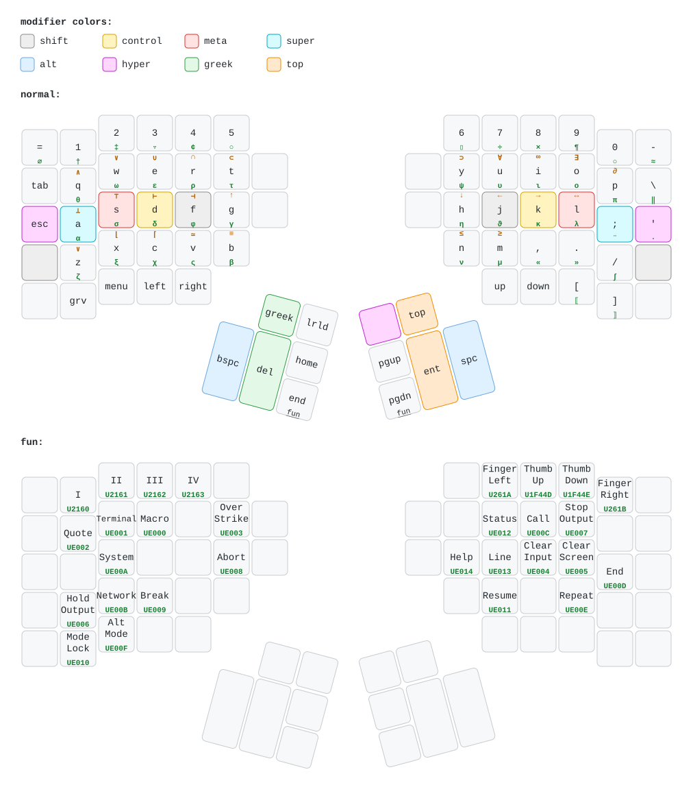
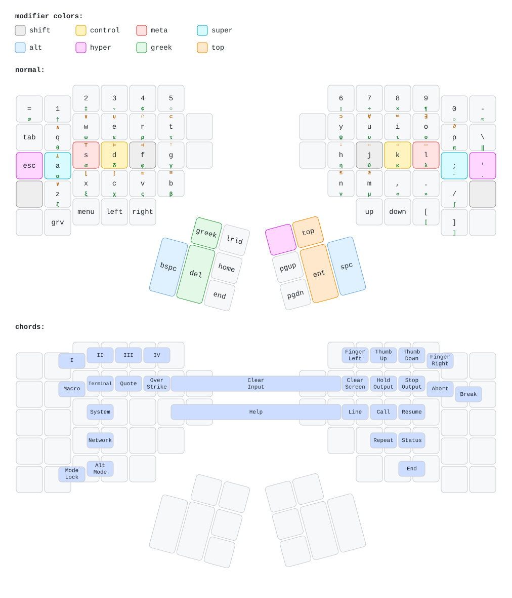

# Space Cadet Keyboard for Kinesis Advantage

Kanata and XKB configs for a Space Cadet-inspired Kinesis Advantage 2 / Advantage 360 layout.

The default variant is layer-based: hold `End` or `PgDn` for a `fun` layer with Space Cadet command keys. Chord-based variants are also included for reference.

## Keymap drawings

### Layered layout (primary)



### Chorded layout (alternate)



## Contents

- `kanata/` — Kanata configs for Advantage 2 and Advantage 360.
  - `*.layered.kanata.kbd` are the recommended layer-based variants.
  - non-layered files are the older chord-based variants.
- `xkb/` — user XKB layout/rules/keymap for Space Cadet symbols and private-use command keysyms.
- `draw-kanata-keymap.py` — converts these Kanata/XKB files into keymap-drawer YAML/SVG.
- `drawings/` — generated Advantage 2 drawings.
- `space-cadet-layered-mnemonics.md` — mnemonic notes for the `fun` layer.
- `reload-spacecadet-xkb.sh` — helper to reapply XKB after Kanata recreates its uinput device.

## Requirements

- [kanata](https://github.com/jtroo/kanata)
- `xkbcomp`
- Python 3 with PyYAML
- [`keymap-drawer`](https://github.com/caksoylar/keymap-drawer) for drawing generation (`keymap` command)

## Generate drawings

```sh
./draw-kanata-keymap.py \
  --kanata kanata/kinesis.advantage2.layered.kanata.kbd \
  --xkb xkb/symbols/spacecadet \
  --qmk-info-json kinesis.qmk.json \
  --output-yaml drawings/kinesis.advantage2.layered.k-draw.yaml \
  --output-svg drawings/kinesis.advantage2.layered.svg
```

## XKB

The Space Cadet command functions are mapped to private-use keysyms (`UE000`...) where possible so desktop/media/system shortcuts do not fire accidentally. Apply the bundled XKB keymap with:

```sh
xkbcomp -I"$PWD/xkb" -w 0 xkb/keymap/spacecadet.xkb "$DISPLAY"
```

Or use `reload-spacecadet-xkb.sh`, which tries to discover the active X display/auth from the current session.

## Dotfiles integration

This repo is intended to be usable standalone, but it is also submodule-friendly for GNU Stow dotfiles. Symlink the files you want from your dotfiles package into this repository, then stow the package as usual.
